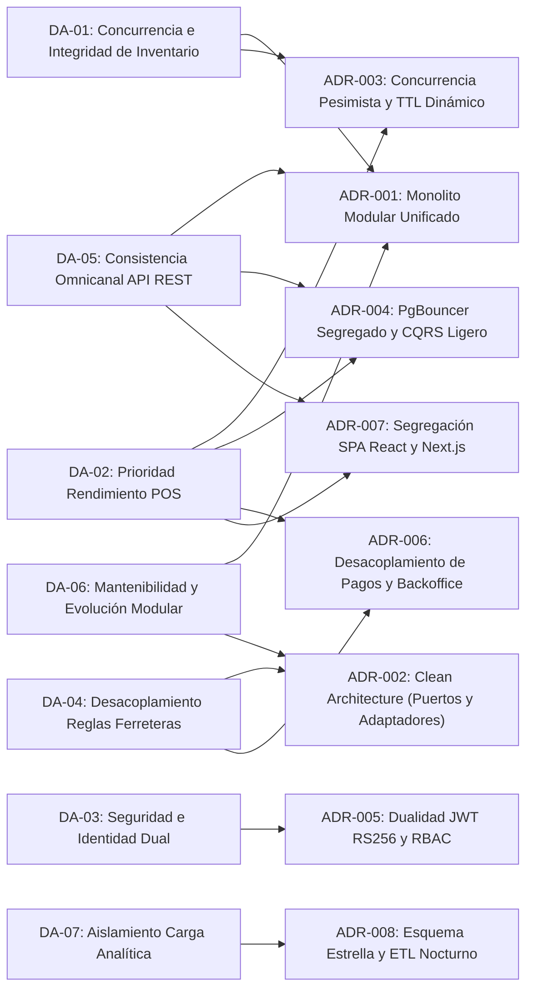

# Drivers Arquitectónicos Rectores (SIGIC Ferretería)

> **Documento:** `analisis-de-sistema/06-driver-arquitectonicos.md`  
> **Versión de Especificación:** 2.2 (Oficial – SIGIC Ferretería)  
> **Disciplina:** Análisis de Requisitos Significativos para la Arquitectura (ASRs – *Architectural Significant Requirements*)  
> **Metodología:** Alineado a la Guía 03 (Trazabilidad RNF / Restricciones / RF hacia Decisiones Arquitectónicas ADR-001 a ADR-008)

---

## 1. Definición y Matriz de Fuerzas Arquitectónicas

Los **Drivers Arquitectónicos** (o Requisitos Significativos para la Arquitectura - ASRs) son aquellas fuerzas funcionales críticas, atributos de calidad (RNFs) y restricciones técnicas o del negocio que condicionan de manera directa la topología, los patrones y la estructura interna del software.

En el caso específico de **SIGIC Ferretería**, el sistema debe resolver la tensión y concurrencia entre dos modelos operativos contrapuestos:
1. **Mostrador Físico POS (In-Store):** Operación presencial en red de área local (LAN), intensiva en teclado numérico y escáner óptico de código de barras, donde constructores y maestros de obra exigen atención y cobro con latencias sub-segundo para evitar colas en horas punta.
2. **Portal E-commerce Multicanal (B2B/B2C):** Operación remota sobre Internet, donde cientos de clientes y contratistas navegan catálogos, consultan precios preferenciales según perfil y compiten por el mismo inventario físico de materiales pesados (cemento, fierro corrugado, perfiles).

A continuación se formaliza la matriz integral de Drivers Arquitectónicos que sustentan el diseño de la solución:

---

## 2. Matriz Formal de Drivers Arquitectónicos

| ID | Driver Arquitectónico | Origen (RF / Atributo de Calidad / Restricción) | ¿Por qué influye en la arquitectura? | Decisión que responde (ADRs relacionados) |
| :--- | :--- | :--- | :--- | :--- |
| **DA-01** | **Concurrencia e Integridad Transaccional de Inventario** | • `RF-INV-001`, `RF-INV-003` • `RF-WEB-002`, `RF-WEB-005` • `RNF-CON-001`, `RNF-CON-002`, `RNF-CON-003` | La sobreventa de materiales estructurales (fierro, cemento) genera costos logísticos de flete inasumibles y rotura de contratos. La coexistencia de ventas rápidas en mostrador y reservas en e-commerce compitiendo por el mismo stock exige garantizar que Stock Disponible = Físico - Comprometido de forma atómica (ACID), con bloqueos pesimistas ordenados (`ORDER BY producto_id ASC`) y actualizaciones condicionadas, eliminando *deadlocks* y sobreventa a cero. | • **ADR-001:** Adopción de Arquitectura Monolítica Modular en Núcleo Transaccional Unificado • **ADR-003:** Estrategia de Concurrencia Pesimista Fina, Fórmulas Segregadas y TTL Dinámico de Reservas |
| **DA-02** | **Rendimiento y Prioridad de Atención en Mostrador** | • `RF-POS-001`, `RF-POS-003`, `RF-POS-004` • `RNF-PERF-001`, `RNF-PERF-004`, `RNF-PERF-005` • Restricciones de Stack | El mostrador físico es el motor primario de facturación y flujo de caja diario. Ráfagas de consultas masivas de contratistas en el portal web (50 req/s) no deben degradar la latencia de cobro en mostrador ($\le 1$ s búsqueda, $\le 2$ s cobro en p95; degradación máx. $\le 10$ %). Requiere aislamiento físico/lógico del pool de conexiones en PgBouncer y consultas de catálogo desacopladas mediante modelo de lectura. | • **ADR-003:** Estrategia de Concurrencia Pesimista Fina, Fórmulas Segregadas y TTL Dinámico de Reservas • **ADR-004:** Segregación de Conexiones en PgBouncer y Desacoplamiento de Lecturas Web (CQRS Ligero) • **ADR-006:** Desacoplamiento Operativo de Pagos: Consola Backoffice Asíncrona y Adaptadores de Pasarela • **ADR-007:** Segregación de Frontends: SPA React 18 (POS Mostrador) y Next.js 14 SSR (Portal Web) |
| **DA-03** | **Seguridad, Identidad Dual y Mínimo Privilegio** | • `RF-PRE-002`, `RF-WEB-001`, `RF-CAJ-001` • `RNF-SEG-001`, `RNF-SEG-003`, `RNF-SEG-005` • Ley N.° 29733 | El sistema atiende a colaboradores internos (cajeros, almaceneros, despachadores, tesorería) y clientes externos (público general, maestros de obra, contratistas). Exponer las mismas APIs o credenciales abriría vectores de escalada de privilegios o exposición de endpoints de caja. Exige dos superficies de API en ASP.NET Core con firma asimétrica RS256, hashing Argon2id y validación estricta de claims RBAC en servidor. | • **ADR-005:** Dualidad de Dominios de Identidad, Autenticación Asimétrica RS256 y RBAC en Servidor |
| **DA-04** | **Desacoplamiento de Reglas de Negocio Ferretero y Fronteras Externas** | • `RF-INV-002`, `RF-INV-005` • `RF-POS-006`, `RF-POS-007`, `RF-POS-008` • `RF-WEB-003` • Restricciones de Frontera (Sec. 2) | Las reglas complejas del negocio ferretero (kardex multialmacén por Costo Promedio Ponderado, factores de conversión multiescala y tarifas mayoristas) y las fronteras operativas externas (PSE/OSE tributario sin firma local `.pfx`, conciliación manual de vouchers bancarios y ausencia de GPS satelital) deben aislarse estrictamente de frameworks y bases de datos mediante puertos y adaptadores. | • **ADR-002:** Implementación del Patrón Clean Architecture (Puertos y Adaptadores) • **ADR-006:** Desacoplamiento Operativo de Pagos: Consola Backoffice Asíncrona y Adaptadores de Pasarela |
| **DA-05** | **Consistencia Omnicanal mediante API REST Unificada** | • `RF-POS-011`, `RF-WEB-001`, `RF-WEB-002` • `RNF-USA-001`, `RNF-USA-002` • Restricciones de Stack (Backend Core) | Dos canales de experiencia de usuario dispares (SPA React para cajeros sin ratón con escáner, y Portal Next.js con SEO y SSR para clientes móviles) deben compartir exactamente el mismo motor de negocio ferretero (cálculo de IGV al 18 %, validación de stock, listas de precios 1, 2 y 3) sin duplicar lógica en clientes ni exponer dependencias directas a base de datos. | • **ADR-001:** Adopción de Arquitectura Monolítica Modular en Núcleo Transaccional Unificado • **ADR-004:** Segregación de Conexiones en PgBouncer y Desacoplamiento de Lecturas Web (CQRS Ligero) • **ADR-007:** Segregación de Frontends: SPA React 18 (POS Mostrador) y Next.js 14 SSR (Portal Web) |
| **DA-06** | **Mantenibilidad y Evolución Modular del Dominio** | • `RF-INV-002`, `RF-INV-005` • `RF-PRE-001`, `RF-PRE-002` • `RNF-SEG-004`, `RNF-DIS-001` | La ferretería proyecta incorporar nuevos almacenes físicos, sucursales en distritos de Ayacucho, nuevas pasarelas de pago y políticas de tarifas mayoristas sin acoplamiento espagueti. La arquitectura debe organizar módulos independientes y desacoplar entidades del ORM y frameworks, facilitando pruebas unitarias y mantenimiento evolutivo sin regresiones. | • **ADR-001:** Adopción de Arquitectura Monolítica Modular en Núcleo Transaccional Unificado • **ADR-002:** Implementación del Patrón Clean Architecture (Puertos y Adaptadores) |
| **DA-07** | **Aislamiento de Carga Analítica Masiva (OLTP vs. OLAP)** | • `RF-REP-001`, `RF-REP-002`, `RF-REP-003`, `RF-REP-007` • `RNF-PERF-002`, `RNF-PERF-003` • Restricciones Tecnológicas | El cálculo mensual de Kardex valorizado por Costo Promedio Ponderado sobre más de 50 000 movimientos y los reportes de márgenes brutos por familia/canal saturan la CPU y bloquean tablas si se ejecutan sobre la base transaccional. La arquitectura debe aislar el motor de base de datos OLTP (`sigic_oltp`) del Datamart en esquema estrella (`sigic_olap`), alimentado por un proceso ETL asíncrono nocturno. | • **ADR-008:** Aislamiento de Base de Datos Transaccional (OLTP) y Datamart Dimensional (OLAP) con ETL Asíncrono |

---

## 3. Análisis Profundo de las Fuerzas Críticas del Negocio Ferretero

### 3.1. Fuerza 1: Concurrencia de Inventario en Materiales de Alta Rotación (DA-01)
- **Problema de Negocio:** Una bolsa de cemento Portland Tipo I o una varilla de fierro de 1/2" se venden en volúmenes elevados simultáneamente a maestros de obra en caja y a ingenieros residentes mediante el portal web. Un desfase de 1 segundo de disponibilidad causa sobreventa, conllevando sobrecostos por flete de devolución y penalidades por incumplimiento en obra.
- **Tensión Técnica:** Si se utiliza un bloqueo a nivel de tabla o transacción larga, el POS se congela. Si se usa consistencia eventual o caché pura, ocurre sobreventa.
- **Respuesta Arquitectónica:** Modelo matemático de magnitudes segregadas:
  $$\text{Stock Disponible} = \text{Stock Físico} - \text{Stock Comprometido}$$
  Se implementa un bloqueo pesimista ultra-corto de fila (`SELECT ... FOR UPDATE` + `UPDATE` condicionado) con orden determinista (`ORDER BY producto_id ASC`) en el checkout y venta POS, respaldado por un worker en segundo plano que libera reservas con TTL dinámico (20 min para pasarela con tarjeta; 1 hora de comprobante y 4 horas de validación para pagos manuales).

### 3.2. Fuerza 2: Rendimiento y Prioridad de Caja en Mostrador (DA-02)
- **Problema de Negocio:** La caja física procesa el 85 % de los ingresos inmediatos de la empresa. Las colas en ferretería con clientes cargando materiales generan cancelación de compras y frustración.
- **Tensión Técnica:** Durante eventos o picos de tráfico en Internet, cientos de sesiones web compiten por conexiones del motor relacional.
- **Respuesta Arquitectónica:** Enrutamiento a través de PgBouncer con dos pools segregados (`pool_pos` prioritario con cuota garantizada de conexiones reservadas; `pool_web` sujeto a límites de concurrencia). El catálogo público de e-commerce lee de una vista optimizada con caché perimetral Nginx/Next.js (desfase máx. 30 s), dejando libre el motor OLTP para las transacciones de mostrador.

### 3.3. Fuerza 3: Desacoplamiento de Fronteras Externas y Lógica Ferretera (DA-04)
- **Problema de Negocio:** Dependencias externas como la indisponibilidad de servidores de SUNAT, demoras en pasarelas bancarias o falta de conectividad móvil de camiones de reparto no pueden detener la emisión de notas de venta internas ni las operaciones del almacén. Asimismo, las complejas conversiones de medida (bolsas, unidades, metros) no pueden dispersarse en procedimientos almacenados o controladores.
- **Tensión Técnica:** Si la transacción de venta intenta conectarse sincrónicamente a SUNAT o a una API bancaria externa, la disponibilidad del POS cae al nivel del eslabón más débil de la cadena.
- **Respuesta Arquitectónica:** Se definen fronteras operativas claras con el patrón Puertos y Adaptadores (*Hexagonal / Clean Architecture*). SIGIC genera payloads estandarizados tributarios y delega la firma/envío a un PSE/OSE externo. En el ámbito bancario, se captura el código de operación y comprobante para conciliación en consola asíncrona de tesorería, manteniendo el POS 100 % operativo y desacoplado.

### 3.4. Fuerza 4: Segregación de Identidades y Superficie de Seguridad (DA-03)
- **Problema de Negocio:** Clientes externos consultan desde dispositivos personales sin confianza corporativa, mientras que colaboradores manipulan arqueos de caja, ajustes de stock y listas de precios mayoristas.
- **Tensión Técnica:** Un solo controlador de autenticación o el uso de tokens compartidos facilita ataques de inyección, escalada de privilegios y fuga de márgenes comerciales.
- **Respuesta Arquitectónica:** Dos emisores de tokens JWT basados en criptografía asimétrica RS256: tokens internos con *claims* RBAC (`Cajero`, `Almacenero`, `Despachador`, `Administrador`) y tokens externos con *audience* pública (`SIGIC_WebClient`) que son rechazados a nivel de middleware en el API Gateway ante cualquier intento de acceso a endpoints operativos internos.

---

## 4. Trazabilidad hacia Decisiones Arquitectónicas (ADRs)

El siguiente grafo modela la correlación estricta entre cada Driver Arquitectónico (`DA-01` a `DA-07`) y las Decisiones Arquitectónicas Estratégicas (`ADR-001` a `ADR-008`):

