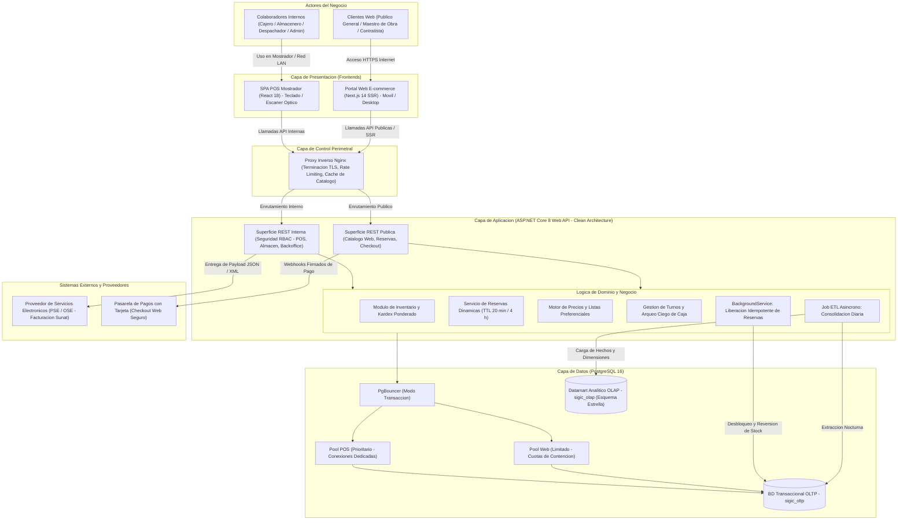
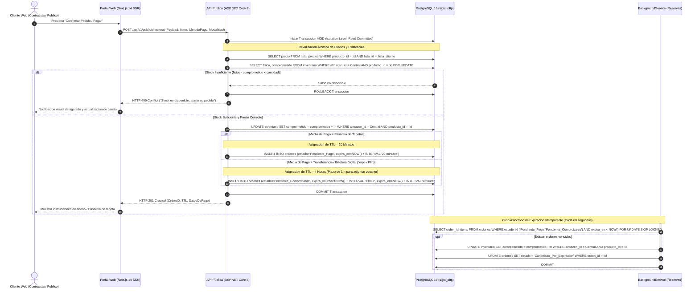

# Especificación Arquitectónica Inicial y Topología del Sistema (SIGIC Ferretería)

> **Documento:** `arquitectura/arquitectura-inicial.md`  
> **Versión de Especificación:** 2.2 (Oficial – SIGIC Ferretería)  
> **Disciplina:** Arquitectura de Software y Diseño de Infraestructura  
> **Modelado:** Clean Architecture, Diagramas C4 Conceptual / UML Sequence y Topología Física  

---

## 1. Visión General de la Arquitectura

La arquitectura de **SIGIC Ferretería** está concebida bajo el paradigma de **Clean Architecture** (Arquitectura Limpia) con un desacoplamiento estricto entre el núcleo de dominio transaccional, los mecanismos de persistencia y las capas de presentación de los dos canales de captura comercial: el **Punto de Venta Mostrador (POS)** y el **Portal Web E-commerce B2B/B2C**.

La plataforma garantiza:
1. **Consistencia Transaccional ACID:** Toda mutación de inventario opera sobre PostgreSQL 16 con bloqueo fino a nivel de fila y aislamiento de concurrencia.
2. **Prioridad Absoluta al Mostrador Físico:** Segregación de conexiones mediante PgBouncer e independencia frente a la carga web.
3. **Aislamiento Operacional vs. Analítico:** Segregación total entre la base de datos operacional (`sigic_oltp`) y el Datamart en esquema estrella (`sigic_olap`).
4. **Seguridad y Dualidad de Identidad:** Tokens JWT firmados asimétricamente con algoritmo RS256 y hashing de contraseñas bajo Argon2id.

---

## 2. Diagrama Conceptual de Arquitectura

El siguiente diagrama modela la interacción integral de los componentes del sistema, desde los actores hasta los servicios externos y la capa de almacenamiento:

---

## 3. Diagrama de Secuencia: Checkout Web y Revalidación Atómica

El flujo crítico de compra digital modela cómo el sistema resuelve la revalidación atómica de existencias y precios frente a una capa de lectura en caché, garantizando cero sobreventas y el manejo del tiempo de vida (*TTL*) de la reserva:

---

## 4. Especificación de Topología de Infraestructura

Para garantizar el aislamiento de recursos, la alta disponibilidad y la resiliencia operativa demandada por el comercio ferretero, se establece una **Topología en Estrella Segregada** compuesta por 5 servidores físicos / virtualizados:

| N.° | Servidor | Función y Rol en la Arquitectura | Sistema Operativo y Software Base | Especificación de Hardware Mínimo | Justificación Técnica de Dimensionamiento |
| :---: | :--- | :--- | :--- | :--- | :--- |
| **1** | **Servidor Web / API** | Nodo perimetral expuesto a Internet. Aloja el proxy inverso, el portal web Next.js y la API ASP.NET Core 8 con sus superficies pública e interna. | Ubuntu Server 22.04 LTS; Nginx 1.24+ (TLS 1.3, Rate Limiting, Gzip); Node.js 20 LTS (Runtime Next.js 14); .NET 8 Runtime (Kestrel). | **8 vCPU** (2.5 GHz o superior), **16 GB RAM**, **200 GB SSD** (NVMe recomendado). | Duplica la capacidad de un servidor básico para absorber 200 sesiones web concurrentes, renderizado SSR móvil en Next.js y 20 terminales de tienda en hora pico. |
| **2** | **Servidor de Base de Datos** | Aloja el motor relacional OLTP (`sigic_oltp`) y el Datamart Comercial (`sigic_olap`) en volúmenes lógicos segregados. | Ubuntu Server 22.04 LTS; PostgreSQL 16; PgBouncer 1.22+ configurado en modo transacción con pools dedicados. | **12 núcleos** (3.0 GHz o superior), **48 GB RAM**, **Almacenamiento NVMe en RAID 1** para OLTP + volumen independiente para Datamart. | Memoria dimensionada para retener el conjunto de trabajo de inventario en `shared_buffers` (~25 % de RAM) y absorber ráfagas de escritura y bloqueos pesimistas de pedidos web sin desplazar al POS. |
| **3** | **Servidor de Reportes** | Generación intensiva por lotes de reportes transaccionales pesados, exportaciones consolidadas a Microsoft Excel y documentos PDF oficiales. | Ubuntu Server 22.04 LTS; .NET 8 Runtime; motor de renderizado y exportación de reportes (ClosedXML / QuestPDF). | **4 vCPU** (2.5 GHz), **8 GB RAM**, **100 GB SSD**. | El renderizado de documentos extensos y reportes tabulares es intensivo en memoria volátil y ciclos de cómputo; su aislamiento evita degradar el servidor de API. |
| **4** | **Servidor OLAP (Datamart)** | Ejecución de procesos ETL asíncronos programados, agregaciones históricas y explotación de tableros de Business Intelligence (BI). | Ubuntu Server 22.04 LTS; .NET 8 Runtime (Servicio ETL y Worker de BI); vistas materializadas indexadas de PostgreSQL. | **4 vCPU** (2.5 GHz), **16 GB RAM**, **300 GB SSD**. | Las agregaciones analíticas sobre tablas de hechos con 24 meses de transacciones requieren memoria amplia para algoritmos de ordenamiento (*Hash Join* y *Sort*). |
| **5** | **Servidor de Directorio y Accesos** | Gestión centralizada de identidades en dos ámbitos (Colaboradores Internos con RBAC y Clientes Web Externos); derivación Argon2id y emisión de JWT RS256. | Ubuntu Server 22.04 LTS; ASP.NET Core 8 Identity / Custom Auth Server; librería criptográfica Argon2id. | **4 vCPU** (2.5 GHz), **8 GB RAM**, **80 GB SSD**. | Argon2id es computacionalmente intensivo por diseño para mitigar ataques de fuerza bruta; un servidor dedicado impide que ráfagas de login saturen la API de ventas. |

---

## 5. Especificaciones de Terminales Cliente

Para garantizar el cumplimiento de los tiempos de respuesta definidos en los requerimientos funcionales y no funcionales, se estandariza el equipamiento cliente en las sedes físicas:

### 5.1. Terminal de Mostrador (POS / Almacén / Despacho)
- **Sistema Operativo:** Windows 10/11 Pro (64 bits) o distribución Linux Desktop LTS.
- **Navegador Web:** Google Chrome, Microsoft Edge o Mozilla Firefox en versiones vigentes (cero instalación local de plugins).
- **Hardware Mínimo:** Procesador doble núcleo a 2.0 GHz, 4 GB de memoria RAM, monitor con resolución mínima nativa de $1024 \times 768$ píxeles.
- **Periféricos de Mostrador:** Pistola lectora óptica de códigos de barras (1D/2D) con interfaz USB en modo emulación de teclado e impresora térmica de tickets de 80 mm (protocolo ESC/POS).

### 5.2. Terminal de Cliente Externo (Portal Web)
- **Dispositivos Soportados:** Teléfonos inteligentes (iOS / Android) y computadoras personales / laptops.
- **Conectividad Mínima de Prueba:** Enlace móvil 4G comercial estándar en Huamanga, logrando renderizado completo de listados en menos de 1.5 segundos.
