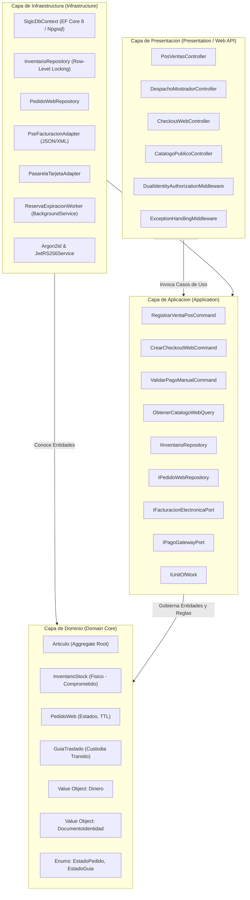
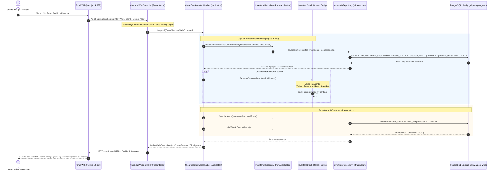

# Enfoque Arquitectónico: Clean Architecture para SIGIC Ferretería

> **Documento:** `arquitectura/enfoque/enfoque-arquitectonico.md`  
> **Versión de Especificación:** 2.2 (Oficial – SIGIC Ferretería)  
> **Disciplina:** Diseño de Arquitectura de Software y Patrones Estructurales  
> **Metodología:** Alineado a la Guía 03 (Enfoque de Clean Architecture, Regla de Dependencia, Trazabilidad SOLID y Flujos de Dominio)

---

## 1. Propósito y Regla de Dependencia

El enfoque arquitectónico adoptado para **SIGIC Ferretería** se fundamenta en los principios de **Clean Architecture** (Arquitectura Limpia), complementado con el patrón de **Puertos y Adaptadores** (*Arquitectura Hexagonal*). El objetivo primordial de este diseño es aislar rigurosamente las políticas del negocio ferretero y los modelos del dominio transaccional de los detalles volátiles de infraestructura: frameworks web, bibliotecas ORM, motores de bases de datos, protocolos de red e interfaces de usuario.

```
       +--------------------------------------------------------+
       |                  PRESENTATION (Web API)                |
       |  +--------------------------------------------------+  |
       |  |                 INFRASTRUCTURE                   |  |
       |  |  +--------------------------------------------+  |  |
       |  |  |                APPLICATION                 |  |  |
       |  |  |  +--------------------------------------+  |  |  |
       |  |  |  |                DOMAIN                |  |  |  |
       |  |  |  |        (Entidades del Núcleo,        |  |  |  |
       |  |  |  |        Reglas Kardex, Precios)       |  |  |  |
       |  |  |  +--------------------------------------+  |  |  |
       |  |  |             (Casos de Uso, CQRS)           |  |  |
       |  |  +--------------------------------------------+  |  |
       |  |          (EF Core, PostgreSQL, PgBouncer,      |  |
       |  |           Pasarelas, Generador PSE/OSE)       |  |
       |  +--------------------------------------------------+  |
       |           (Controladores Internos POS y Públicos Web)  |
       +--------------------------------------------------------+
                          --> TODAS LAS DEPENDENCIAS
                              APUNTAN HACIA EL CENTRO -->
```

### La Regla de Dependencia en SIGIC
En Clean Architecture, el código fuente se organiza en capas concéntricas gobernadas por una ley inquebrantable:
> **Las dependencias de código fuente solo pueden apuntar hacia adentro, hacia las políticas de más alto nivel.**

Esto se traduce en las siguientes garantías para SIGIC Ferretería:
1. **Independencia del Motor de Persistencia:** Las entidades centrales (`Articulo`, `InventarioStock`, `PedidoWeb`, `GuiaTraslado`) y los cálculos de costo promedio ponderado y existencias disponibles se desconocen por completo si la persistencia subyacente es PostgreSQL 16, SQL Server o una estructura en memoria para pruebas. La base de datos es tratada como un mecanismo de E/S periférico.
2. **Independencia de los Canales de Entrada (UI):** Ni la SPA del mostrador (React 18) ni el portal e-commerce (Next.js 14) imponen lógica al dominio. Ambos canales son tratados como mecanismos externos que entregan solicitudes HTTP y reciben DTOs estructurados.
3. **Independencia de Proveedores Tributarios y Pasarelas:** La facturación electrónica con el PSE/OSE y el procesamiento de pagos se definen como contratos abstractos (puertos). Cambiar de proveedor de facturación SUNAT o de pasarela no altera ni una sola línea del núcleo de negocio ferretero.
4. **Testabilidad Completa del Dominio:** El 100 % de las reglas de sobreventa, bloqueos lógicos, descuentos mayoristas y transiciones de guías pueden probarse mediante pruebas unitarias rápidas y deterministas en memoria, sin requerir la instanciación de un servidor web ni de contenedores de base de datos.

---

## 2. Descomposición de Capas en SIGIC Ferretería

La solución de software en ASP.NET Core 8 Web API se descompone formalmente en cuatro capas claramente tipificadas:

```
SIGIC.Solution/
├── src/
│   ├── SIGIC.Domain/           (Capa Núcleo: Entidades, Value Objects, Reglas Puras)
│   ├── SIGIC.Application/      (Capa Casos de Uso: Commands, Queries, Puertos)
│   ├── SIGIC.Infrastructure/   (Capa Adaptadores: EF Core 8, Npgsql, PSE, Pagos)
│   └── SIGIC.Presentation/     (Capa Entrada: Controllers POS/Web, Middlewares)
```

---

### 2.1. Capa de Dominio (`SIGIC.Domain`)

Es el corazón del sistema y representa el nivel más alto de abstracción. Contiene los conceptos empresariales, las estructuras de datos fundamentales y la lógica intrínseca del negocio ferretero. **No tiene dependencias de ninguna otra capa ni paquete de terceros.**

#### Componentes Principales:
- **Entidades del Núcleo y Agregados:**
  - `Articulo`: Encapsula código correlativo, SKU, EAN-13, familia, subfamilia, marca, unidad base y el flag `DisponibleEnWeb`.
  - `Almacen`: Identifica depósitos físicos (Almacén Central, Mostrador 1, Mostrador 2) y sus ubicaciones.
  - `InventarioStock`: Agregado que gobierna las cantidades físicas y comprometidas de un artículo en un almacén específico:
    $$\text{StockDisponible} = \text{StockFisico} - \text{StockComprometido}$$
    Contiene métodos de mutación protegidos (`ReservarStockWeb`, `LiberarReserva`, `ConfirmarSalidaFisica`).
  - `PedidoWeb`: Agregado raíz que modela el pedido de comercio electrónico, controlando sus líneas, importes desglosados y transiciones de estado.
  - `ReservaStock`: Modela el bloqueo temporal de existencias con marca de tiempo UTC y tiempo de vida dinámico (*TTL*).
  - `GuiaTraslado`: Representa la transferencia interna entre Almacén Central y tiendas físicas con custodia en tránsito.
  - `CajaTurno`: Modela la sesión de cobro del cajero, fondo inicial y el arqueo ciego.

- **Objetos de Valor (*Value Objects*):**
  - `Dinero`: Moneda formal en Soles peruanos (`decimal Monto`), garantizando redondeo contable exacto a dos decimales.
  - `DocumentoIdentidad`: Validador formal de formato de DNI (8 dígitos) y RUC (11 dígitos validados mediante algoritmo módulo 11).
  - `CodigoOperacionBancaria`: Cadena de 4 a 12 caracteres que valida formato de identificación financiera para pagos manuales.
  - `FactorConversion`: Permite transformar unidades físicas (docenas, bolsas de cemento, millares) a la unidad de medida base del Kardex.

- **Enumeraciones Fuertemente Tipadas (*Enums*):**
  - `EstadoPedidoWeb`: `PendienteValidacion`, `EnPreparacionDeposito`, `ListoParaRetiro`, `EnRuta`, `Entregado`, `CanceladoExpiracion`.
  - `EstadoGuia`: `Borrador`, `EnTransito`, `Recibido`, `Rechazado`.
  - `TipoComprobante`: `TicketInterno`, `BoletaVenta`, `FacturaComercial`.
  - `PerfilCliente`: `PublicoGeneral`, `MaestroDeObra`, `Contratista`, `Distribuidor`.

- **Reglas de Negocio Puras en Dominio:**
  - *Invariante de Inventario:* El stock físico jamás admite saldos negativos; toda operación que resulte en $StockFisico < 0$ lanza `InventarioInsuficienteException`.
  - *Regla de Reserva Dinámica:* TTL de 20 minutos para transacciones de pasarela con tarjeta; TTL de hasta 4 horas para pagos manuales con ventana de 1 hora para adjuntar el comprobante.

---

### 2.2. Capa de Aplicación (`SIGIC.Application`)

Orquesta el flujo de información hacia y desde el dominio. Contiene la lógica específica de los casos de uso del sistema. Implementa el patrón **CQRS** (Command Query Responsibility Segregation) separando las mutaciones de estado de las consultas optimizadas.

#### Componentes Principales:
- **Comandos de Mutación (Commands):**
  - `RegistrarVentaPosCommand`: Orquesta la venta inmediata en mostrador, el cobro mixto, el decremento atómico del stock físico y el registro en el Kardex.
  - `CrearCheckoutWebCommand`: Valida el carrito, revalida precios de la lista asignada, adquiere reservas con bloqueo pesimista en orden determinista y genera el `PedidoWeb`.
  - `ValidarPagoManualCommand`: Ejecutado por Tesorería en Backoffice; coteja el código de operación, valida la constancia y promueve el pedido a `EnPreparacionDeposito`.
  - `DespacharGuiaCommand` y `ConfirmarRecepcionGuiaCommand`: Gestionan las transiciones de las guías de traslado interno entre almacenes.
  - `CerrarTurnoCajaCommand`: Procesa el arqueo ciego del cajero, contrasta contra el saldo teórico del sistema y registra discrepancias contables.

- **Consultas Optimizadas (Queries):**
  - `ObtenerCatalogoWebQuery`: Consulta de alta velocidad del catálogo público con precios según el perfil autenticado y stock disponible proyectado.
  - `ObtenerDisponibilidadPosQuery`: Consulta en tiempo real sub-segundo del stock físico y comprometido por almacén para el mostrador.
  - `ObtenerPedidosListosParaRetiroQuery`: Consulta ligera para la pantalla del despachador en mostrador (`RF-POS-011`).

- **Puertos de Salida (Interfaces de Abstracción):**
  - `IInventarioRepository`: Métodos de persistencia transaccional con semántica de bloqueo pesimista (`ObtenerParaActualizarConBloqueoAsync`).
  - `IPedidoWebRepository`, `IVentaPosRepository`, `ICajaRepository`.
  - `IPagoGatewayPort`: Contrato para integración con pasarelas de pago con tarjeta (`ProcesarPagoAsync`, `VerificarWebhookAsync`).
  - `IFacturacionElectronicaPort`: Contrato para generar y despachar el payload JSON/XML estandarizado hacia el PSE/OSE tributario.
  - `IUnitOfWork`: Manejador transaccional atómico sobre la base de datos relacional.

---

### 2.3. Capa de Infraestructura (`SIGIC.Infrastructure`)

Contiene las implementaciones tecnológicas concretas de las interfaces declaradas en la Capa de Aplicación. Comunica con el mundo exterior: bases de datos, brokers, sistemas tributarios y servicios de red.

#### Componentes Principales:
- **Persistencia Transaccional (PostgreSQL 16 y EF Core 8):**
  - `SigicDbContext`: Configuración de entidades mediante Fluent API, mapeo de tablas relacionales en el esquema `sigic_oltp`, índices B-Tree en artículos y almacenes.
  - Implementaciones concretas de repositorios (`InventarioRepository`, `PedidoWebRepository`) utilizando Npgsql con extensiones de bloqueo fino `SELECT ... FOR UPDATE` y adquisición ordenada (`ORDER BY producto_id ASC`).
  - Configuración del proveedor de conexiones hacia **PgBouncer** gestionando los pools separados `pool_pos` y `pool_web`.

- **Adaptadores de Integración Externa:**
  - `PseFacturacionAdapter`: Implementa `IFacturacionElectronicaPort`, construyendo el payload estructurado JSON/XML con desglose de IGV (18 %) y despachándolo vía cliente HTTP resiliente (Polly) hacia el PSE/OSE contratado.
  - `PasarelaTarjetaAdapter`: Implementa `IPagoGatewayPort`, validando las firmas de los webhooks de pasarela y protegiendo ante solicitudes repetidas.

- **Servicios en Segundo Plano (*Background Services*):**
  - `ReservaExpiracionWorker`: Tarea periódica en segundo plano que se ejecuta cada minuto, busca pedidos con reservas vencidas que no confirmaron comprobante o validación, e invoca de manera idempotente la liberación del stock comprometido.
  - `EtlAnaliticoJob`: Tarea programada en ventana nocturna que extrae los datos de `sigic_oltp`, ejecuta el cálculo del costo promedio ponderado de kardex y puebla el Datamart en estrella `sigic_olap`.

- **Servicios Criptográficos y de Seguridad:**
  - `Argon2idPasswordHasher`: Implementación del algoritmo Argon2id ($m=65536, t=3, p=4$) con sal aleatoria de 16 bytes.
  - `JwtTokenService`: Generación y firma de tokens de acceso mediante algoritmo asimétrico **RS256** utilizando la clave privada RSA corporativa.

---

### 2.4. Capa de Presentación (`SIGIC.Presentation` / Web API)

Es la puerta de entrada de la aplicación HTTP. Despacha las solicitudes hacia los comandos y queries de la Capa de Aplicación mediante controladores REST construidos sobre ASP.NET Core 8.

#### Componentes Principales:
- **Segregación de Superficies de Controladores:**
  - **Superficie Interna (`/api/internal/*`):** Exclusiva para la red local y colaboradores autenticados.
    - `PosVentasController`: Endpoints de alta prioridad para búsqueda de artículos y cobro en mostrador.
    - `InventarioAlmacenController`: Gestión de recepciones, transferencias entre sucursales y ajustes de inventario.
    - `CajaTurnosController`: Apertura, cobros, cierres y arqueo ciego.
    - `BackofficeTesoreriaController`: Validación de comprobantes bancarios (Yape/Plin/Transferencias).
    - `DespachoMostradorController`: Pantalla ligera de retiro en tienda (`RF-POS-011`).
  - **Superficie Pública (`/api/public/*`):** Expuesta al portal e-commerce a través de Internet.
    - `CatalogoPublicoController`: Listado jerárquico de materiales, navegación por familias y fichas técnicas con cache HTTP.
    - `CheckoutWebController`: Creación del pedido web, reserva atómica de existencias y subida de comprobantes de pago.
    - `WebhooksController`: Recepción de eventos firmados de la pasarela de pagos.

- **Middlewares Perimetrales y Filtros:**
  - `DualIdentityAuthorizationMiddleware`: Verifica el emisor y audiencia del JWT. Bloquea con `HTTP 403 Forbidden` cualquier intento de un token de cliente web (`SIGIC_WebClient`) de acceder a la ruta `/api/internal/*`.
  - `ExceptionHandlingMiddleware`: Captura excepciones de dominio (`InventarioInsuficienteException`, `ReglaNegocioException`) y las traduce a respuestas estandarizadas RFC 7807 (*Problem Details*) con códigos `HTTP 400`, `HTTP 409` o `HTTP 422`.
  - `TransactionAuditMiddleware`: Registra de forma inmutable en `Audit_Log` la IP, usuario y mutación efectuada sobre entidades sensibles (`RNF-SEG-004`).

---

## 3. Trazabilidad de Principios de Diseño y Patrones

El diseño de SIGIC Ferretería aplica de manera explícita los principios de ingeniería de software para asegurar robustez y alta cohesión:

### 3.1. Principios SOLID Aplicados al Dominio Ferretero

1. **Single Responsibility Principle (SRP - Responsabilidad Única):**
   - Cada comando y query en la capa de aplicación atiende exactamente una intención del usuario. `RegistrarVentaPosCommand` no calcula el costo histórico de kardex ni genera el PDF del comprobante; delega la mutación a las entidades y la persistencia a los repositorios.
   - En la interfaz del mostrador, la pantalla de despacho (`RF-POS-011`) se separa completamente de la pantalla de validación de comprobantes bancarios de tesorería (`RF-WEB-003`).

2. **Open/Closed Principle (OCP - Abierto/Cerrado):**
   - El sistema admite nuevos medios de pago o nuevos proveedores tributarios sin modificar la lógica central del caso de uso. Basta con implementar una nueva clase que satisfaga `IPagoGatewayPort` o `IFacturacionElectronicaPort` e inyectarla en el contenedor de dependencias.

3. **Liskov Substitution Principle (LSP - Sustitución de Liskov):**
   - Cualquier implementación concreta del repositorio de inventario (`PostgreSqlInventarioRepository` o `InMemoryInventarioRepository` para pruebas) respeta cabalmente los contratos y comportamientos esperados por el caso de uso sin generar efectos secundarios no declarados.

4. **Interface Segregation Principle (ISP - Segregación de Interfaces):**
   - Interfaces pequeñas y enfocadas. La pantalla de despacho ligero no depende de una interfaz masiva de inventario, sino exclusivamente de contratos específicos para consultar el estado del pedido y registrar el retiro físico.

5. **Dependency Inversion Principle (DIP - Inversión de Dependencias):**
   - Las capas de Dominio y Aplicación no hacen referencia a ningún paquete de PostgreSQL, Entity Framework Core o librerías de terceros. La Capa de Infraestructura es quien depende de las interfaces declaradas en la Capa de Aplicación.

### 3.2. Patrones de Diseño Arquitectónicos Utilizados

- **Repository Pattern:** Abstrae la persistencia de las entidades (`IInventarioRepository`), permitiendo consultar agregados completos y garantizar invariantes antes de persistir.
- **Adapter Pattern (Puertos y Adaptadores):** Encapsula las particularidades de protocolos de pasarelas de pago y esquemas tributarios de SUNAT.
- **Unit of Work:** Coordina transacciones compuestas de múltiples repositorios garantizando confirmación atómica (*Commit*) o reversión total (*Rollback*).
- **Outbox Pattern:** Asegura que los eventos de auditoría y payloads tributarios generados en una venta se guarden en la misma transacción relacional de la venta, garantizando que ninguna factura quede sin registro auditable ante caídas de red.

---

## 4. Diagramas Arquitectónicos del Enfoque

### 4.1. Diagrama de Capas Concéntricas y Regla de Dependencia

El siguiente diagrama ilustra la estructura de capas concéntricas y cómo las dependencias de código fuente fluyen exclusivamente hacia el centro:



---

### 4.2. Flujo de Control vs. Inversión de Dependencias: Creación de Pedido Web con Reserva Atómica

El siguiente diagrama detalla cómo interactúan las capas durante una operación crítica: un cliente ejecuta el checkout en el portal web y el sistema adquiere una reserva atómica sobre existencias de cemento y fierro en el Almacén Central:



---

## 5. Conclusiones y Beneficios para el Proyecto

La aplicación rigurosa de **Clean Architecture** en **SIGIC Ferretería** garantiza:
1. **Protección del Negocio frente al Cambio Tecnológico:** Las reglas complejas de kardex valorizado, factores de conversión y márgenes comerciales quedan blindadas en el dominio, facilitando migraciones tecnológicas futuras sin riesgo de regresión en las reglas operativas.
2. **Cero Acoplamiento con Entornos Inestables:** Las dependencias hacia entes externos (SUNAT, pasarelas bancarias locales) se mantienen estrictamente confinadas en adaptadores periféricos descartables o sustituibles.
3. **Escalabilidad y Seguridad Operativa:** La segregación estricta entre controladores internos (POS) y públicos (Web) elimina de raíz riesgos de acceso indebido, mientras que la organización de casos de uso permite un crecimiento ordenado del equipo de desarrollo de la asignatura.
