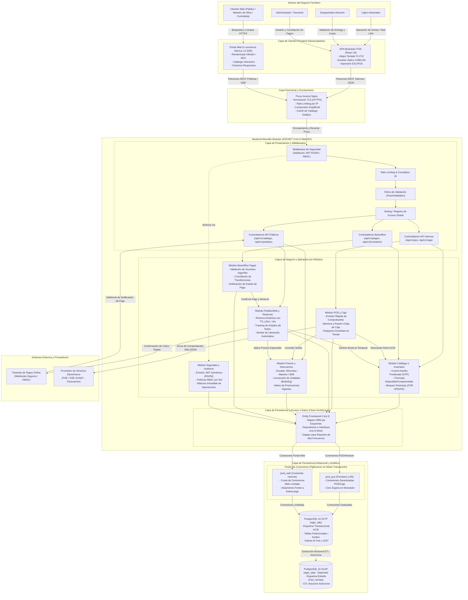

# Estilo Arquitectónico Global: Monolito Modular en Capas (Cliente-Servidor)

> **Documento:** `arquitectura/estilo-arquitectonico.md`  
> **Versión de Especificación:** 2.2 (Oficial – SIGIC Ferretería)  
> **Disciplina:** Arquitectura de Software y Diseño de Sistemas Distribuidos  
> **Metodología y Estándar:** Alineado a la Guía 03 (Paso 4: Estilo Arquitectónico, Justificación Técnica, Reglas Estructurales y Topología Mermaid)  
> **Sistema:** SIGIC Ferretería (Sistema Integrado de Gestión de Inventario y Comercialización)

---

## 1. Justificación del Estilo Seleccionado

Para dar respuesta rigurosa a los desafíos de concurrencia omnicanal, consistencia de inventario y mantenibilidad en **SIGIC Ferretería v2.2**, se adopta formalmente el estilo arquitectónico de **Monolito Modular con Arquitectura en Capas bajo el Paradigma Cliente-Servidor Desacoplado**.

### 1.1. Un solo artefacto backend desplegable en ASP.NET Core 8 Web API
El backend transaccional se compila y ejecuta como una única unidad de despliegue altamente cohesiva y estructurada internamente en módulos funcionales autónomos:
- **`Inventario` (Kardex y Stock):** Gestión centralizada de existencias físicas, valorización por Costo Promedio Ponderado (CPP), multialmacén y control de mermas/roturas.
- **`VentasPOS`:** Facturación rápida de mostrador presencial, emisión de boletas/facturas electrónicas y despacho inmediato.
- **`PedidosWeb`:** Gestión de compras e-commerce, reservas de existencias con caducidad temporal (TTL) y seguimiento de estados de retiro en tienda.
- **`Precios`:** Motor de tarifas multiescala (minorista, maestro de obra, contratista B2B, promociones y factores de conversión por bulto/unidad).
- **`Caja`:** Apertura, arqueo ciego, control de flujo en efectivo y cierre diario por turno de cajero.
- **`Seguridad` (Identidad y Auditoría):** Autenticación criptográfica con JWT asimétricos (RS256), autorización basada en roles (RBAC) y bitácora inmutable de auditoría.

### 1.2. Mitigación de sobrecarga operacional y eliminación de complejidad distribuida
Frente a una aproximación basada en microservicios independientes, la adopción del Monolito Modular resuelve de raíz las siguientes fricciones técnicas y operativas:
1. **Eliminación de la sobrecarga operacional (DevOps Overhead):** Un único pipeline de integración y despliegue continuo (CI/CD), un solo proceso runtime en ASP.NET Core 8 gestionado por systemd/Docker, y supervisión centralizada que se ajusta a la capacidad del equipo de ingeniería.
2. **Latencia de red nula en red de área local (LAN mostrador):** La comunicación entre los módulos de precios, inventario y caja ocurre en memoria mediante llamadas tipadas directas ($< 1$ ms) en lugar de saltos de red HTTP/gRPC inter-servicio, garantizando tiempos de respuesta de cobro en mostrador físico $p95 \le 1.0$ segundo.
3. **Eliminación de transacciones distribuidas (Patrón Saga / 2PC):** En una ferretería de materiales pesados (cemento, fierro de construcción, agregados), la *eventual consistencia* propia de los microservicios generaría ventanas de sobreventa crítica cuando un cliente compra en línea y simultáneamente un cajero factura en ventanilla. El monolito modular asegura **transacciones ACID inmediatas** respaldadas de forma nativa por el motor relacional **PostgreSQL 16**, con bloqueos pesimistas a nivel de fila (`SELECT ... FOR UPDATE`) sobre la misma base de datos relacional.

### 1.3. Modelo Cliente-Servidor Desacoplado vía APIs REST
El sistema divide radicalmente la presentación del cómputo de negocio mediante contratos RESTful estandarizados sobre HTTPS/JSON:
- **Cliente SPA Mostrador POS (React 18):** Optimizado para la red local (LAN), enfocado en ultra-baja latencia, navegación exclusiva por atajos de teclado (`F1`-`F12`), integración con lectoras de código de barras y compatibilidad con impresoras térmicas ESC/POS.
- **Cliente Portal Web (Next.js 14 SSR):** Diseñado para clientes públicos y corporativos en Internet (móvil y desktop), optimizado para SEO, catálogo interactivo con renderizado del lado del servidor (SSR) y tiempos de carga interactiva $LCP \le 1.5$ segundos en redes móviles 4G.
- Ambos clientes consumen de forma unificada pero segregada la superficie de exposición del backend Web API, asegurando que la lógica de cálculo comercial resida exclusivamente en el servidor.

---

## 2. Reglas de la Arquitectura

Para salvaguardar la integridad del sistema, prevenir el acoplamiento caótico ("código espagueti") y garantizar la evolución a largo plazo, se establecen tres reglas cardinales de observancia obligatoria:

### Regla 1: Comunicación Estricta entre Capas e Inversión de Dependencias
- La solución backend se rige bajo los principios de **Clean Architecture**:
  $$\text{Presentation} \longrightarrow \text{Infrastructure} \longrightarrow \text{Application} \longrightarrow \text{Domain}$$
- Cada capa lógica únicamente puede invocar a la capa inmediatamente inferior. La capa de **Dominio** constituye el núcleo puro y no posee referencias a frameworks, bibliotecas externas ni bases de datos.
- Todo acceso a infraestructura periférica (acceso a base de datos relacional, pasarela de pago web, servicios del Proveedor de Servicios Electrónicos SUNAT - PSE/OSE) debe realizarse a través de interfaces y abstracciones (puertos) inyectadas mediante el contenedor de Inversión de Control de ASP.NET Core (`IServiceCollection`).

### Regla 2: Límites Lógicos Modulares Estrictos y Encapsulamiento de Datos
- Cada módulo funcional (`Inventario`, `VentasPOS`, `PedidosWeb`, `Precios`, `Caja`, `Seguridad`) posee un *Bounded Context* rigurosamente demarcado.
- **Prohibición de acceso cruzado directo a tablas:** Queda terminantemente prohibido que el código de un módulo (por ejemplo, `PedidosWeb`) ejecute consultas SQL directas o instancie entidades del `DbContext` pertenecientes a otro módulo (por ejemplo, `Caja` o `Kardex`).
- La interacción inter-módulo se efectúa exclusivamente mediante:
  1. **Servicios de Aplicación o Contratos de Interfaz Púbica:** Métodos tipados expuestos intencionalmente por el módulo receptor (ej. `IInventarioReservaService`).
  2. **Eventos de Dominio en Memoria:** Notificaciones asíncronas dentro del mismo proceso (vía mediadores en memoria) para efectos colaterales (ej. `VentaPOSCompletadaEvent` que desencadena la salida del Kardex y la actualización del saldo de caja).

### Regla 3: Persistencia Transaccional Unificada con Pools Segregados en PgBouncer
- El almacenamiento transaccional central reside en una única instancia de **PostgreSQL 16** (`sigic_oltp`), complementada con un Datamart analítico segregado (`sigic_olap`) para reportería y balance mensual.
- Para evitar que los picos de tráfico de usuarios concurrentes navegando el portal e-commerce saturen las conexiones de la base de datos y bloqueen la facturación del mostrador físico, se interpone **PgBouncer** en modo de asignación por transacción (*Transaction Pooling*), gestionando dos pools estrictamente segregados:
  - **`pool_pos` (Prioritario / LAN):** Conexiones reservadas y garantizadas de alta prioridad para las cajas y almacén físico, con tiempo de espera de conexión prácticamente nulo.
  - **`pool_web` (Contenido / Internet):** Pool con cuota estricta de conexiones concurrentes para las solicitudes públicas del portal e-commerce, protegiendo al núcleo del sistema de cualquier ataque de denegación de servicio o degradación por sobretráfico web.

---

## 3. Diagrama de Arquitectura Global

El siguiente diagrama modela la arquitectura integral de **SIGIC Ferretería v2.2**, reflejando la interacción completa entre actores, frontends segregados, proxy perimetral, la estructura modular en capas del backend ASP.NET Core 8, la capa de persistencia administrada con PgBouncer y las integraciones con sistemas externos:

---

## 4. Trazabilidad con Decisiones de Arquitectura y Atributos de Calidad

| Elemento Estructural | Justificación Técnica en SIGIC Ferretería v2.2 | Decisión / Requisito Asociado |
| :--- | :--- | :--- |
| **Monolito Modular ASP.NET Core 8** | Evita latencias inter-nodo y garantiza transacciones ACID unificadas sobre el inventario compartido. | `ADR-001`, `ADR-002`, `DA-01`, `DA-06` |
| **Doble Frontend (React 18 / Next.js 14)** | Interfaz ultrarrápida para escáner/teclado en LAN mostrador versus catálogo SEO con SSR en Web. | `ADR-007`, `DA-02`, `DA-05` |
| **Segregación PgBouncer (`pool_pos` / `pool_web`)** | Protege el mostrador físico frente a picos de tráfico en línea, blindando la disponibilidad transaccional. | `ADR-004`, `DA-02`, `DA-05` |
| **Reserva con TTL Dinámico** | Bloqueo temporal para evitar sobreventa en materiales de alta demanda (cemento, fierro) sin congelar stock permanentemente. | `ADR-003`, `DA-01`, `DA-04` |
| **Dualidad de Identidad y JWT RS256** | Firma asimétrica con claims segregados que impide escalada de privilegios de usuarios web a funciones internas. | `ADR-005`, `DA-03` |
| **Aislamiento OLTP / OLAP** | El cálculo analítico pesado de Kardex valorizado no compite por recursos de CPU/RAM con las ventas en curso. | `ADR-008`, `DA-07` |
